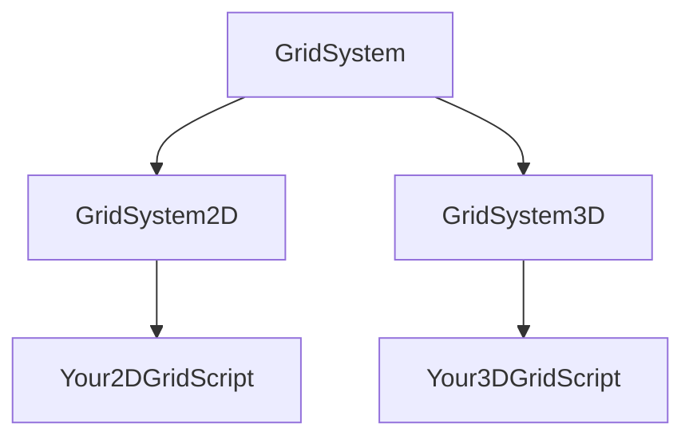

# 🧮 DT.GridSystem Unity Manual

A comprehensive guide to the **DT.GridSystem** — a generic Unity grid framework supporting both 2D (XY) and 3D (XZ) layouts.  
This manual covers architecture, usage, and function-by-function documentation with clarity.

---

## 📚 Table of Contents

1. [📘 Introduction](#-introduction)
    
2. [🧩 Concepts & Architecture](#-concepts--architecture)
    
3. [🔧 How It Works](#-how-it-works)
    
4. [🚀 Getting Started](#-getting-started)
    
5. [🏗️ Core Classes](#-core-classes)
    
6. [🛠️ API Reference](#-api-reference)
    
7. [🧪 Usage Examples](#-usage-examples)
    
8. [💡 Best Practices](#-best-practices)
    
9. [❓ FAQ](#-faq)
    
10. [📄 License](#-license)
    

---

## 📘 Introduction

Welcome to **DT.GridSystem**, a flexible and extensible system for managing 2D and 3D grids in Unity.

> 🧠 **Use Cases:**  
> Turn-based tile games, AI navigation maps, level editors, placement systems, and more.

### ✅ Features

- ✅ Generic base class (`GridSystem<T>`)
    
- ✅ Seamless grid ↔ world conversion
    
- ✅ Supports XY (2D) and XZ (3D) layouts
    
- ✅ UnityEvent-based change notifications
    
- ✅ Built-in debug gizmo drawing
    

---

## 🧩 Concepts & Architecture

DT.GridSystem is structured into 3 clean layers:

|Layer|Responsibility|
|---|---|
|**Storage**|Holds a 2D array of `TGridObject`|
|**Conversion**|Grid <-> World position translation|
|**Utilities**|Snapping, debug visualization, events|




## 🔧 How It Works

### 🗃️ Grid Array

Internally stores data as:

``` cs : 
TGridObject[,] gridArray = new TGridObject[width, height];
```

### ⚙️ Initialization

On `Awake()`:

- Allocates the array to the defined size.
    
- Calls your overridden `CreateGridObject(...)` for each cell.
    

---

### 🔄 Add / Remove / Get

Use these public methods to manage grid content:

- `AddGridObject(int x, int y, T value)`
    
- `RemoveGridObject(int x, int y)`
    
- `GetGridObject(int x, int y)`
    
- `GetGridObject(Vector3 worldPos)`
    
- `TryGetGridObject(...)` for safe retrieval
    

---

### 🌍 Grid ↔ World Conversion

Override the abstract methods:

- `GetWorldPosition(int x, int y)`
    
- `GetGridPosition(Vector3 worldPos)`
    

These handle translating coordinates between grid space and Unity world space.

---

### 🎯 Visualization

- Draws grid lines and bounds in `OnDrawGizmos()`
    
- Subclasses can extend visualization with custom markers
    
- Toggle `drawGizmos` to control this
    

---

### 📢 Events

Every time the grid is updated:

``` cs : 
UnityEvent OnGridUpdated
```

...is fired, so listeners can respond dynamically.

---

## 🚀 Getting Started

1. **Add DT.GridSystem** scripts to your Unity project
    
2. **Inherit** one of the following:
    
    - `GridSystem2D<T>` (for XY)
        
    - `GridSystem3D<T>` (for XZ)
        
3. **Override**:
    
    ``` cs : 
    protected override T CreateGridObject(GridSystem<T> grid, int x, int y)
    ```
    
4. **Configure** in the Inspector:
    
    - Grid Size: `(X, Y)`
        
    - Cell Size: `float`
        
    - Enable Gizmos: ✅
        
5. **Run** your scene — the grid initializes and draws automatically!
    

---

## 🏗️ Core Classes

|Class|Purpose|
|---|---|
|`GridSystem<T>`|Abstract base for all grids|
|`GridSystem2D<T>`|2D implementation on XY plane|
|`GridSystem3D<T>`|3D implementation on XZ plane|

---

## 🛠️ API Reference

### 1. Initialization

|Function|Description|
|---|---|
|`Awake()`|Allocates and populates the grid array|
|`SetUpGrid(Vector2Int size, float cellSize)`|Rebuilds grid and cell dimensions at runtime|

---

### 2. Creating Cell Data

``` cs: 
protected override T CreateGridObject(GridSystem<T> grid, int x, int y)
```

Returns the initial value per cell.  
_Default: `default(T)`_

---

### 3. Managing Grid Contents

|Function|Parameters|Returns|Description|
|---|---|---|---|
|`AddGridObject`|(x, y, value, snap?)|—|Inserts object and fires update|
|`RemoveGridObject`|(x, y)|T|Removes and returns old value|
|`GetGridObject`|(x, y) / (Vector2Int) / (Vector3)|T|Retrieves by index or world|
|`TryGetGridObject`|(...)|bool|Safe retrieval pattern|

---

### 4. Coordinate Conversion

|Function|Input|Output|Purpose|
|---|---|---|---|
|`GetWorldPosition(x, y)`|indices|`Vector3`|Maps to Unity world space|
|`GetGridPosition(worldPos)`|`Vector3`|`Vector2Int`|World → Grid|
|`SnapWorldPosition(worldPos)`|`Vector3`|`Vector3`|Center-align to grid cell|

---

### 5. Utilities & Events

|Function|Returns|Description|
|---|---|---|
|`GetRowCount()`|`int`|Grid height|
|`GetColumnCount()`|`int`|Grid width|
|`IsInBounds(Vector2Int)`|`bool`|Bounds check|
|`OnGridUpdated`|`UnityEvent`|Subscribe to changes|

---

### 6. Debug Visualization

- `OnDrawGizmos()` draws lines and markers
    
- Can be extended in subclasses
    
- **Performance Tip**: Disable in builds
    

---

## 🧪 Usage Examples

### 🟦 Integer Grid (2D)

``` cs :
public class IntGrid : GridSystem2D<int>
{
      protected override int CreateGridObject(GridSystem<int> grid, int x, int y) => 0;
}
```
Use:
``` cs : 
AddGridObject(3, 2, 5); int val = GetGridObject(3, 2);
```

---

### 🧱 Tile Map (3D)

``` cs :
public class TileMap : GridSystem3D<TileData>
{
     protected override TileData CreateGridObject(GridSystem<TileData> grid, int x, int y) => new TileData(); 
}

```

Use:

``` cs : 
var pos = SnapWorldPosition(transform.position);
```

---

## 💡 Best Practices

- ✅ Only override `CreateGridObject` and conversion methods
    
- ✅ Use `TryGetGridObject` in uncertain states
    
- ✅ Call `SetUpGrid` for dynamic resizing
    
- ✅ Toggle `drawGizmos` to manage editor performance
    

---

## ❓ FAQ

**Q:** _Can I resize the grid at runtime?_  
**A:** Yes! Call `SetUpGrid(newSize, newCellSize)`.

**Q:** _What if I call Add out-of-bounds?_  
**A:** The call is ignored silently — no crash.

**Q:** _How do I customize gizmos?_  
**A:** Override `OnDrawGizmos()` in your subclass, and call `base.OnDrawGizmos()`.

---

## 📄 License

MIT License — Free to use, modify, and distribute.  
Pull requests and attribution are welcome but not required.
